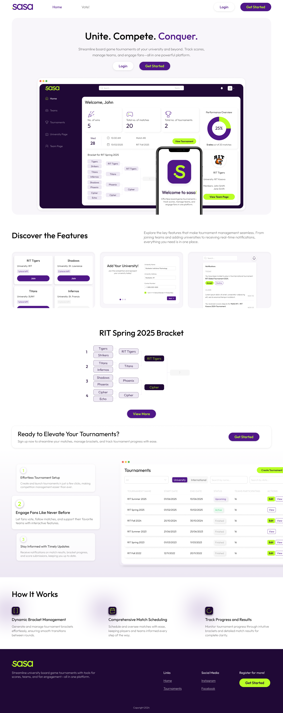
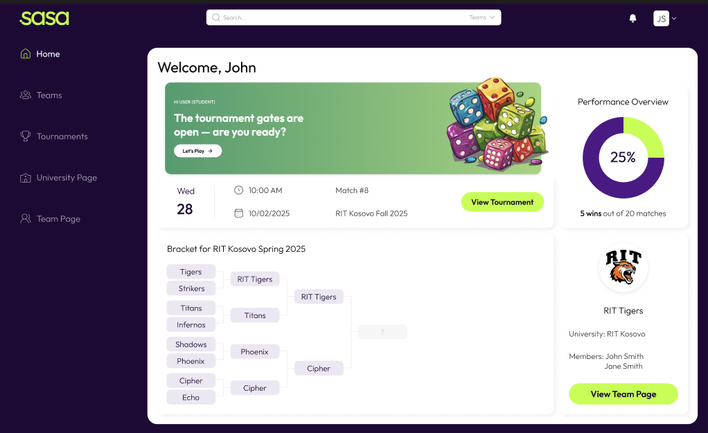
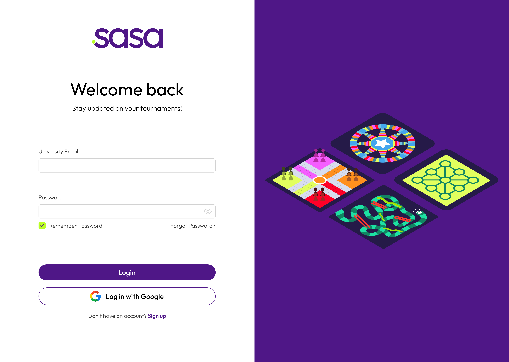

# Sasa — Game Board Tournament Platform

Sasa is a modern web application for organizing and managing board game tournaments.  
This repository contains **only the frontend** built with **Next.js**, **TypeScript**, and **TailwindCSS**.  
The backend is not yet implemented.

---

## Features

- Create and manage board game tournaments  
- Player registration and leaderboard tracking *(UI only, no backend integration)*  
- Live scoring and match results *(planned)*  
- Responsive UI built with TailwindCSS  
- Server-side rendering and API routes powered by Next.js *(future backend integration planned)*

---

## Tech Stack

- [Next.js 14](https://nextjs.org/) — React framework with SSR/ISR  
- [TypeScript](https://www.typescriptlang.org/) — static typing  
- [TailwindCSS](https://tailwindcss.com/) — utility-first CSS  

---

## Screens & Designs

- **Figma Design:** 
- **Screenshots:**  
  -   
  - 
  - 

---

## Getting Started

### 1. Clone the repository
```bash
git clone https://github.com/fionaveseli/sasa.git
cd sasa
```
2. Install dependencies
```
pnpm install
# or
npm install
```
3. Run the development server
```
npm run dev
Open http://localhost:3000
 with your browser.

```

## API Endpoints

See endpoint.md
 for a list of planned endpoints.
Currently, these endpoints are not connected to a backend service.

---

## License

This project is licensed under the terms of the MIT License.
See the LICENSE
 file for details.
